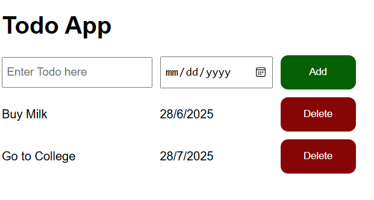

# 📝 ToDo App

A simple and elegant ToDo App where users can **add tasks**, **mark them as completed**, and **delete them** once done. Built using **HTML, CSS, and JavaScript**.

---

## 📌 Features

- ✅ Add a new task to the list
- ✔️ Mark a task as completed
- 🗑️ Delete tasks once done
- 📦 Data stored temporarily (page refresh resets tasks)
- 🎨 Simple and clean UI

---

## 🚀 Live Demo

👉 [Click here to try the ToDo App](https://tanyav-rshney.github.io/todo-app/)

## 📁 GitHub Repository

👉 (https://github.com/Tanyav-rshney/todo-app)

---

## 📸 Screenshot

## 🔧 Technologies Used

- HTML
- CSS
- JavaScript

---

